#句子的结构及其层次
  * 1.主题和述题的关系:主题一般用は、も等提示助词来表示
    * これはわたしの本だ
  * 2.主谓关系
    * 春が来た。
  * 3.修饰关系
    * 速く走る
    * 綺麗な女の子
  * 4.补助关系(中心词＋补助词)
    * 勉強している
    * やってみる
  * 5.独立语、外位语
  * 6.句子成分的倒置

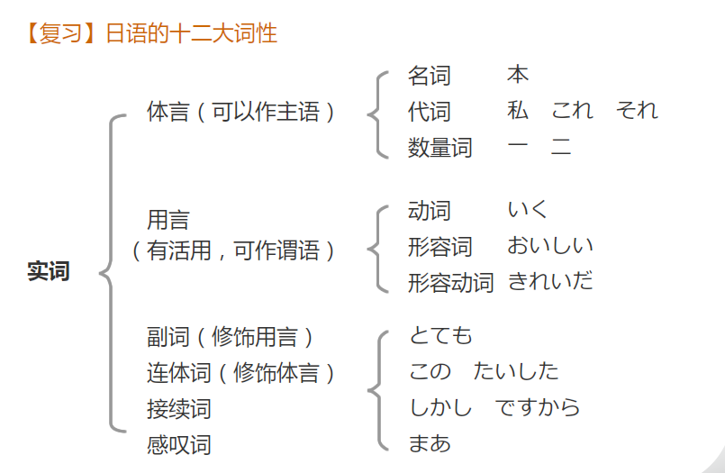
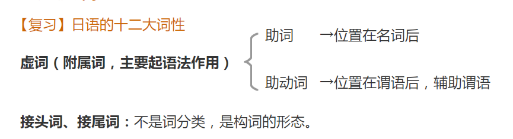

#动词的体
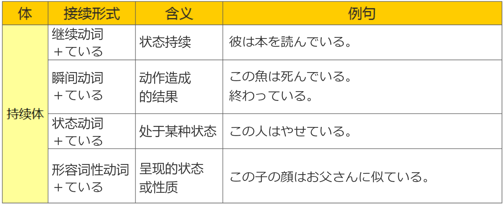
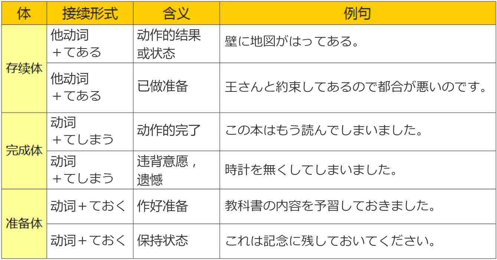

###行为动词做定语的形式
  * 时态关系
  * 行为动词「～ている」修饰名词，用于描述眼前、现在持续的行为或状态
  * 相对的先后关系

#自动词和他动词

###自动词
  * 1、人或动物的行为
  * 2、事物的状态以及自然界的现象
  * 3、人的内心感情

###他动词
  * 1、人在自己的意志支配下，对物体施加的行为，使之发生某种变化
  * 2、对事物施加的行为也可以是抽象、无形的，或者说是单方面的
    * 約束を破る
    * 平和を求める
  * 某些自动词的使役态具备他动词的功能或作用

###区别
  * 1.当接续表示人的行为、意志的句型时，需要用他动词
  * 2.当表示事情的结果、状态时，需要用自动词
  * 3.表示状态的时候，不能和表示意志、命令、愿望、劝诱的句型连用
  * 4.当句子只需要关注事情本身，不需要说出是谁做的，则选用自动词
  * 5.「発展する・普及する」等的サ变动词，以使役态的形式表达他动词。
    * 文化を発展させる
    * 知識を普及させる
  * 6.在日语的一些惯用表达中，他动词表示状态，这些时候常常会与说话人的身体方面相关。
    * 涙を流しながら語る。（流す）
    * 鼻水を垂（た）らしている子ども（垂らす）
  * 7.他动词不表示说话人的意志，而是表示后悔、遗憾等心情。
    * 飲み過ぎて体を壊した。（壊す）
    * 鍵をなくして家に入れなかった。（無くす）
    * 彼は友人の冷遇（れいぐう）に心を痛めた。（痛める）
  * 8.他动词对应的自动词能表示被动的意思。

| 他动词| 自动词  |
| : | : |
|挟む：夹住|挟まる：被夹住|
|つかむ：抓住|捕まる：被抓住|
|見つける：找到|見つかる：发现，被找到|

###下一段为他动词的，则对应的是自动词
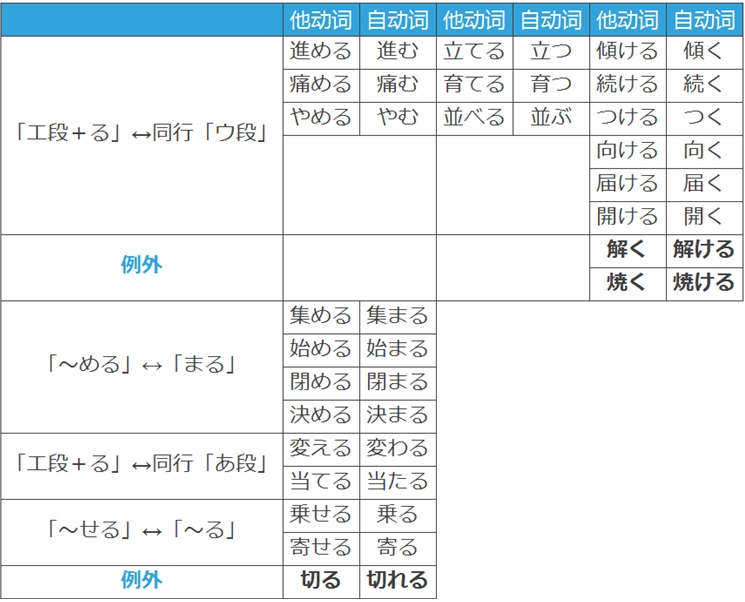

###以「す」为词尾的五段动词是他动词，对应的是自动词，例如：
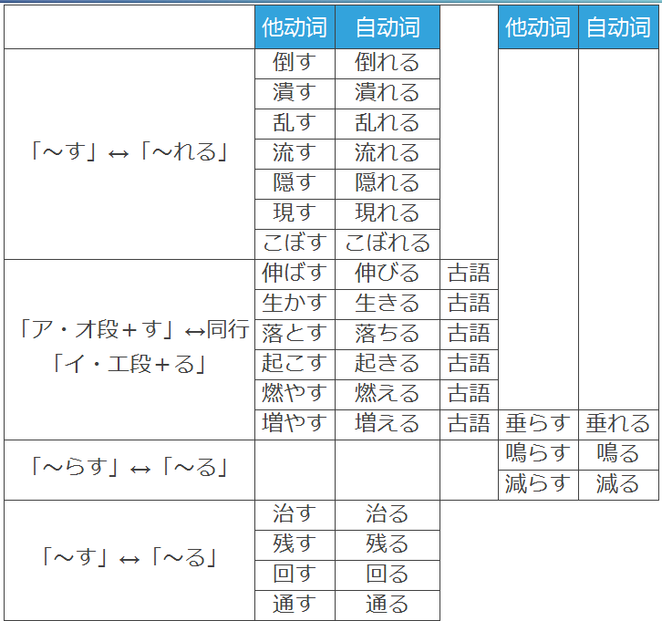

###现代日语的使役态的变化，使役态和他动词都是可以使用的。
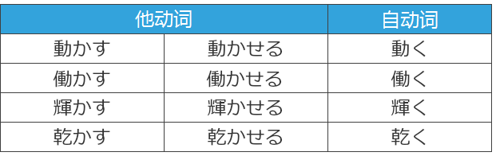

###读音发生改变的自他动词
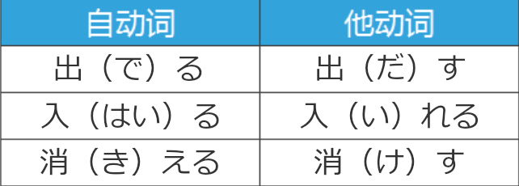

#敬体和简体
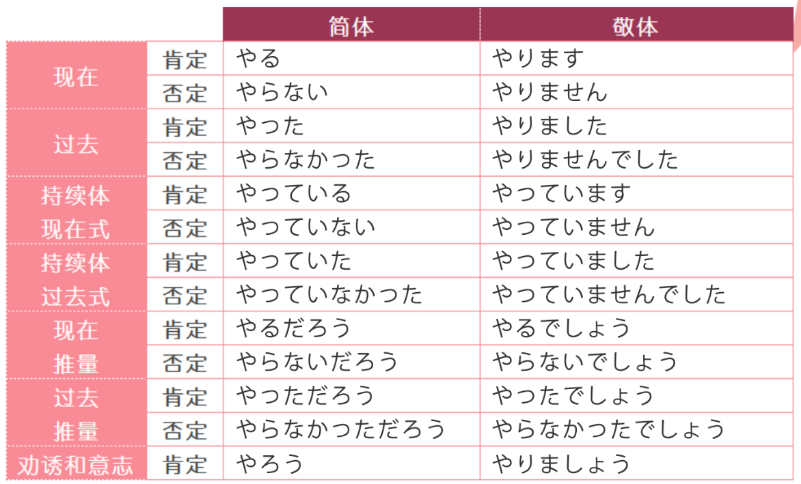
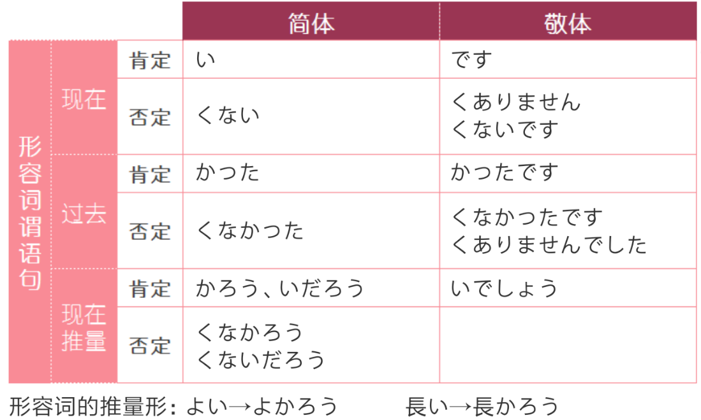
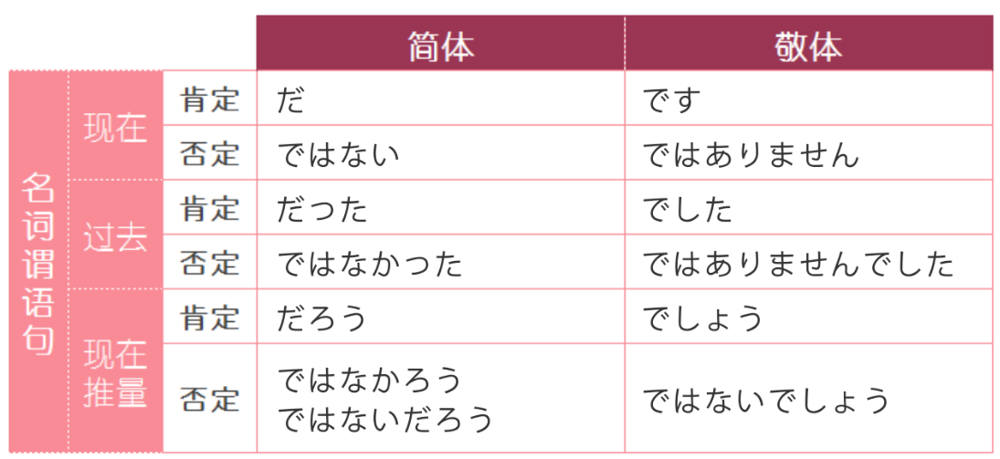
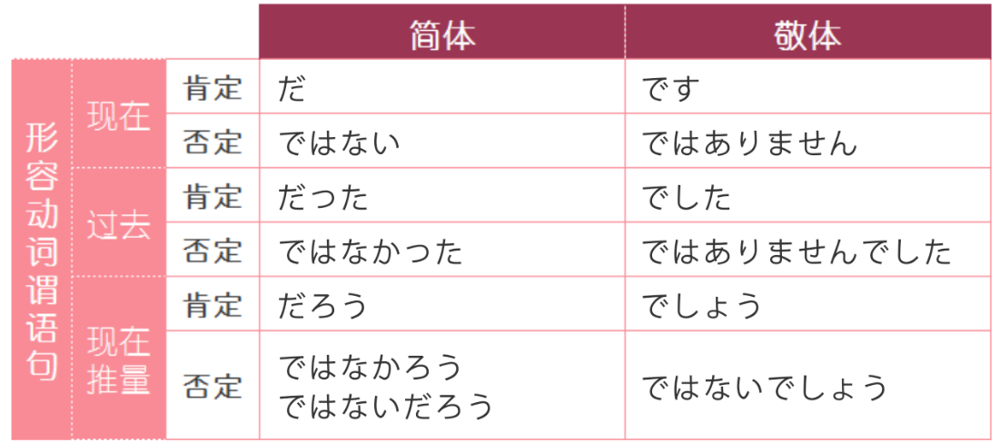

#活用
##动词

| |五段动词 | 一段动词 | サ变动词 | カ变动词 |
|- | : | : |: |: |: |
|连用1(ます) |う段 → い段|去掉る|しま|きます|
|连用2(て)|イ音便（く、ぐ) 促音便（う、つ、る） 拨音便（ぬ、ぶ、む） 无音便（す）|去掉る|して|きて|
|未然1(ない)|う段→あ段＋ない う结尾时候把う变成わ|去掉る|しない|こない|
|未然2(意志)|う段→お段+う|去掉る+よう|しよう|こよう|
|假定形|う段→え段＋ば|る→れ＋ば|すれば|くれば|
|命令形|う段→え段|去掉る＋ろ/よ|せよ しろ|こい|

  * 基本型：动词原形
  * 终止形：可以结句的形式，简体敬体都可
  * 连体形：可以修饰体言的形式(包含各种时态)
    * 有原形、た形、ている、ていた等形式(现在时的连体形即动词原形)
  * 连用形：可以修饰用言的形式
    * 连用形1：ます形
    * 连用形2：て形
  * 未然形
    * 未然形1：ない形，：表示否定
    * 未然形2：意志形 ＋う・よう：用于表示“被动态”、“可能态”、“使役态”、“被役态”及“敬语体”、“自发”、“否定命令”等各种态的情况。
  * 假定形
    * 1.假定条件
    * 2.恒常、客观的规律
    * 3、经常、反复的情况
  * 命令形
    * 常用语口号/口令

##动词的态

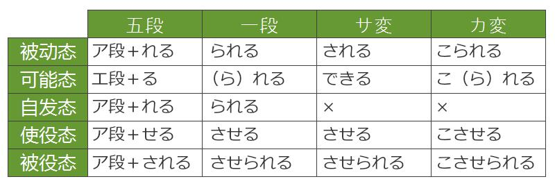

###被动态
  * 动宾关系：主语＋は/が＋宾语＋を＋动词
  * 被动关系：宾语＋は/が＋主语＋に/から＋动词被动态
  * られる：受け身•可能•自発•尊敬

###可能态
  * 多用于会话文。侧重于表达心情语气，比较口语化和非正式。
  * 他动词构成的可能态，原本的动宾结构的助詞「を」→「が」
  * 意味：1. 能力；2. 性质；3. 可能性
  * 【补充1】ら抜き言葉：一段动词的可能态去掉「ら」的口语用法。
  * 【补充2】自动词的否定形带有可能态的含义。
  * 【补充3】能力主体用「に」。

###自发态
  * 【释义】表示人不由得、禁不住做出某些动作。多为和情感有关的动词。
  * 【接续】与被动态相同
  * 和动作者或说话人的主观意志无关，动作或状态自然发生显现的客观状况，“不由得…”。
  * 思う→思われる
  * 考える→考えられる
  * 感じる→感じられる
  * 思い出す→思い出される
  * 偲ぶ→偲ばれる
  * 案じる→案じられる
  * 悔やむ→悔やまれる

###使役态
  * 【用法】包含强制、指示、放任、许可等含义。
  * 谓语动词为自动词的句中使役对象的助词用「を」
  * 谓语动词为他动词的句中使役对象的助词用「に」
  * 自动词变使役态后具备他动词的作用。

###被役态
  * 被动态+使役态
  * 【用法】句子的主语被迫做某件事。使役者用「に」表示。
  * 含有并非本人的意愿，被迫，“不得不…”。

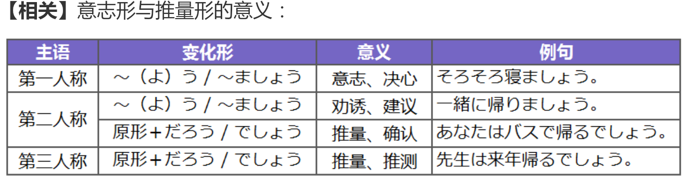

复合动词活动方法：

| 动词 |形容词 | 形容动词|
|- | : | : |: |
|连用形|词干|词干|

##形容词
| 终止形 |连用形 | 连体形 | 假定形式 |未然形|
|- | : | : |: |: |: |: |
|原型|い→く い→かっ(た)|原型|い→ければ|否定:い→からず  い→くない 推测:い→かろう +だろう|

##形容动词
| 终止形 |连用形 | 连体形|未然形|假定形|
|- | : | : |: |: |: |
|词干+だ|词干+に/で/だつ|词干+な|词干+だろ|　（ば）|

#助词

副助词与格助词叠用的情况
  * 1.副助词与「が」「を」重叠时，格助词可省略。
  * 2.副助词与其他格助词重叠时，不可省略格助词，

###格助词
  * へ：移动方向
  * から：起点
  * まで：终点
  * より：比较

#####が：
  * 1.表示主语
    * 一般性陈述，无特殊强调之意
    * 主语未知，谓语已知
    * 例子：だれが李さんですか
  * 2.客观描述
  * 3.对象语(对象语:表示感觉、情感、好恶、巧拙、需要、明白、可能的词)
  * 4.从句主语

#####に：
  * 1.存在场所
  * 2.时间点
  * 3.比例、分配的基准
  * 4.目的地(强调移动的方向)
  * 5.动作着落点
  * 6.动作对象
    * お母さんに電話をします
  * 7.来去的目的
    * わたしは町へ映画を見に行きます
  * 8.动作、作用的结果
    * もう冬になりました
    * 二つに切ってください
  * 9.表示比较、评价的基准
    * 【接续】体言＋に
    * ここは買い物に便利です。
  * 10：主体
    * 彼にはできない。　→能力主体
    * 私には兄がいる。　→拥有的主体
  * 11.累加、搭配
    * 青い上着に赤いネクタイ
  * 12.行为资格
    * お礼に金をもらう。
  * 13.用途、目的
    * 私はそのお返しに何か送りたい

#####で：
  * 1.做某事的场所
  * 2.手段、方法、材料
  * 3.范围
  * 4.状态、条件
    * 二人で食事をします
  * 5.时间，空间，数量，价值等的限度
    * 今日の授業はこれで終わります
  * 6.原因(后项不能加命令、禁止、劝诱等表达主观意志的句子)
    * 彼は病気で学校を休みました

#####を：
  * 1.宾语：
  * 2.离开的地点
  * 3.移动路径

#####と：
  * 1.并列
  * 2.动作对手、对象
  * 3.说话、思考的内容。(前接简体句)
  * 4.比较对象

#####の：
  * 1.所属、性质、状态
    * お母さんの服
  * 2.准体助词，代替前面出现过的体言
    * りんごは大きいのと小さいのがあります
  * 3.定语从句中做主格助词,代替が
    * 彼の買ったカバンはいくらですか

###提示助词
  * は:可以提示句子的任何成分。表示强调、提示、对比
  * も：
    * 1.也
    * 2.～も～も：全都
    * 3.疑问词＋も：表示全面肯定/否定
    * 4.数量词＋も：表示强调
  * でも：
    * 1.接在疑问词后面，只能表示全面肯定
    * 2.表示概指事物
      * 【解释】表示“之类的”，相当于「など」「とか」
      * 【接续】体言/某些助词＋でも
  * しか：表示限定，“只有……”，后项多接否定~しか～ない
  * って：代替 と　という　といのう
  * こそ：表示强调，代替が、を

###并列助词
  * と：并列
  * や：并列，暗示还有其他
  * とか：例举
    * 【接续】体言・用言终止形
    * 常用于口语
  * か：选择
  * たり：例举/动作或状态的反复
    * 【接续】体言、用言的过去式
    * 动词て形＋たり（だり）
    * 形容词い→かったり 
    * 形容动词词干和名词だったり

###终助词
  * か：疑问
  * ね：确认、感叹
    * 1.确认
    * 2.感叹。(双方都知道的事)
  * よ：强调,告诉对方他所不知道的事
  * けど：表示委婉语气，省略后面的话

###副助词
  * ぐらい（くらい）：
    * 1.概数：数词+
    * 2.程度：副词
      * 往往含有程度较低，或带有轻视的语气
      * 程度高,和ほど互通
  * ほど
    * 1.概数/程度
  * か：不确定
  * だけ：表示限定，“仅仅……”
    * 【接续】体言・助词・副词・動詞連体形+だけ
  * ながら：动作同时进行
  * など：大约
  * ずつ：数词/すこし＋～
    * 1.等量的反复
    * 2.表示均摊，也
  * なんか：之类，など的口语
  * ばかり：
    * 【用法1】接在数量词后表示大概的数量
    * 【用法2】接在名词后表示限定,“净是…”。
    * てばかりいる：表示尽是在做某个行为，一直在做某件事。
    * 名词＋ばかりではなく/ばかりじゃなく：不仅…
  * 动词原形＋ばかりだ：表示刚刚完了或动作完成后不久。
    * たところ：着重于表示时间间距较短的“刚刚”，时间间距一般不超过半天。
    * たばかり：着重于表示语气上的“刚刚”，并非真的时间间距很短。
  * だらけ：
    * 表示“~非常多”“全是、净是”等含义
    * 而且大多同时表示觉得“脏”或“不好”的心情。
  * さえ：只要
    * 【接续】体言＋さえ＋假定形式「ば･たら」
    * 【接接续】形容动词＋でさえ＋假定形式「ば･たら」
    * 【接用法】表示“只要…就…”，表示条件的唯一性。
    * 【接补充】动词「ます」形＋さえ＋すれば／しなければ
  * のに：
    * 【接续】简体句＋のに
    * 【接续】形容动词/名词＋な＋のに
    * 【用法1】置于句末，表示事与愿违的遗憾、惋惜、后悔等消极的心情
    * 【用法2】作为接续助词，表示转折关系，往往有意外、不满、埋怨的语气
    * 【用法3】单纯表示转折
    * 【补充】のに：形式名词「の」＋格助词「に」，表示目的、用途等
  * まで：
    * 【意思1】程度、界限
      * 动词原形＋まで：表示"到…为止，一直…”，
      * まだ～ていない：表示“现在还没有…”，强调当前的状态。
    * 【意思2】表示语气、单纯表示极端例子
  * あまり：
    * 【用法】后续肯定,表示程度剧烈、厉害。
      * 类似表达还有「あんまり・あんまりにも・あまりにも」
  * こそ：【用法】唯有…、才是…、只有…
    * 【接续】名词+こそ
    * 【接续】形容动词+で+こそ
    * 【接续】动词连用形+こそ
  * なんて：なんか、など、などと、などという、などというのは
    * 【用法】表示讲话人的吃惊；表示轻视；等等、…之类的。

###接续助词
  * が：
    * 顺接：无含义
    * 逆接：但是
  * て：
    * 并列：教室は大きくてきれいです
    * 先后：夏休みが終わって、新学期が始まりました。
    * 因果：
  * から：原因
    * 【接续】終止形（敬・簡）+から
    * 表示主观的原因，后面可以用推测、命令、请求等表示主观意志的句子
  * ので：原因
    * 【接续】用言连体形+ので、名词、形容动词+なので
    * 表示客观的原因。后面不用命令、意志、请求等表示主观意志的句子
  * ても（でも）：
    * 表示让步 ，即使……也……
    * 表示既定条件逆接，即前项事项已经发生了，但是并没有能对后项事项造成预期的影响
  * ては：消极的假设
    * 可替换为「と」、「ば」的用法
  * し：列举原因
    * 【接续】终止形
    * 列举原因/并列：既……又
  * けれども：口语中被简化成けれど，けど
    * 逆接：前后两项矛盾，但是……
    * 顺接：单纯的接续或者前提
  * と：假设
    * 【接续】终止形（简体）
    * 1.恒常条件/经常反复的情况
    * 2.假设：
      * 只用于稳定的、长期的、具有广泛性的事实陈述。
      * 后项不能用命令、意志、请求等主观的表达方式。
      * 「と」通常不与「もし」一起出现。
    * 3.两个事项的并存
  * たら：
    * 1.表示假定完了 的条件， 用来表示偶发性、临时性、具体性的事物。
      * 只能用たら的情况：前后项具有明确先后关系，且后项带有祈使语气
      * 具有明确的先后关系。,重心在后半句的条件上。
      * 【解释】假定前项条件成立的基础上陈述后项。
      * 【接续】动词て形＋たら
      * 【接续】形容词（かったら）
      * 【接续】形容动词/名词＋だったら
      * たらどうですか：用于对对方提出建议。
    * 2.共起：指发生动作A的时候，紧接着或同时发生动作B(与と相似)
      * 强调动作的持续时，可使用「…ていたら」
  * なら：
    * 【用法1】承接对方的话，并以此为话题展开叙述。
    * 【用法2】表示假定。多用于对未知事物进行假设或把对方提到的事情作为前提条件，后项发表自己的意见，看法，建议等。
    * ① 用于表示事物的真理和自然规律的“恒常条件”时，此时不能用なら
    * 「なら」后项通常搭配意志、要求、评价等主观语气
    * ② それなら：作为接续词使用，“那样的话”“那么”。
    * ③ 一般反事実的假设，多会使用「なら」
  * ば：假设
    * 【接续】假定形
    * 恒常条件/经常反复的情况/假定条件
    * 表示一般性条件,重心在前半句的条件上。
    * 一般用在令人期待，肯定的表达中
  * まで
    * 【意思2】范围
      * 【用法】一般后续表示许可或可能的动词。
      * 后接表示持续性的行为动词或状态的动词；
    * までに：
      * 【用法】表示动作结束或开始的最后期限。中文意思“（最迟）…之前”。
      * 后接表示瞬间性的行为或状态动词。

|と|ば|なら|たら|
| : | : |: |: |: |
|恒常 前项确定条件,后项发现或结果|恒常|意志 非前后关系 提出话题 「た」形+对过去的假定|意志 前后关系 どうですか 前项确定条件,后项发现或结果|

======格助词======

1. 主格助词
が：表示主语
の：仅在定语从句中表示主语

2. 宾格助词
を：表示宾语
が：仅在谓语为「～たい」或可能动词的句中，表示宾语

3. 领格助词
の：用于名词与名词之间，“……的”
が：<文言>用于名词与名词之间，“……的”

4. 补格助词
に：① 时间点 
　　② 静态场所
　　③ 方向
　　④ 目的
　　⑤ 对象
　　⑥ 比例
で：① 动态场所
　　② 原因理由
　　③ 方式方法
　　④ 范围
から：起点
まで：终点
へ：方向
を：<后接自动词>
　　① 离开
　　② 经过
と：① 动作共同者
　　② 直接引用
　　③ 状态转化的对象
　　④ 以某种状态进行动作或作用，“……地”
より：① 比较
　　　② <文言>起点

======并列助词======

と：完全并列
や：「～や～や～など」，不完全并列
か：选择，“或者”
とか：列举
たり：「～たり～たりする」，动作的并列

======接续助词======

が／けれども：① 顺接
　　　　　　　② 逆接
　　　　　　　③ 放在句尾，省略后句，表示委婉
から：主观原因
ので：客观原因
のに：“明明……却……”，表达遗憾、不满
ても：①“即使……也……”
　　　②「～ても～ても」，“无论……还是……”
し：并列，“既……又……”

======提示助词======

は：① 提起话题
　　② 加强语气
も：① 提起话题，“也”
　　②「～も～も」，“……也……也”
　　③「疑问词＋も」，全面肯定或全面否定
　　④「大数量词＋も＋肯定」，“多达……”
　　⑤「小数量词＋も＋否定」，“连……都没”
　　⑥ 极端事例，“甚至……”
　　⑦“顶多、至多、充其量”
でも：①「疑问词＋でも」，全面肯定或全面否定 
　　　②「～でも～でも」，“无论……还是……”
　　　③ 极端事例，“甚至……”
　　　④ 举例，暗指其他同类事物，“……之类的”
こそ：特别强调，“正是、才是、就是”

======副助词======

だけ：① 表示限定，“只，仅仅”
　　　② 表示最大限度，“尽量，尽可能”
ばかり：①「数词＋ばかり」，“大约……” 
　　　　② 表示限定，“只，光，净，都”
ぐらい：①「数词＋ぐらい」，“大约……”
　　　　② 表示程度，用于比喻、举例等
ほど：①「数词＋ほど」，“大约……”
　　　② 表示程度，用于比喻、举例等
か：「疑问词＋か」，“某个……”
ずつ：「数词＋ずつ」，平均等份

======终助词======

か：疑问等
ね：感叹等
よ：劝诱等

#句型
  * 动词未然形＋う（よう）とする：正要……
    * 【用法1】表示就要做某个动作或某种作用就要发生。
    * 【用法2】接意志动词，表示努力尝试做某事，强烈的意愿
  * ことにする
    * 【接续】「动词连体形/ない形」＋ことにする
    * 【解释】表示做出的某项人为决定,不含有为之努力的含义
    * ことにした：表示决定已经做好了
    * ことにしている：表示决定的结果已经成为一种习惯
  * ことになる
    * 【接续】「动词连体形/ない形」＋ことになる
    * 表示一种由某团体或组织产生的客观决定。非人为决定
    * ことになった：某项决定已经产生。
    * ことになっている：产生的决定成为了一种习惯
  * 体言＋にする：从众多的选项当中选择一个
  * 表示变化
 	 * 动词连体形+ようになる
 	 * 动词未然形+なくなる
  * 劝诱做某事：
    * ～ませんか：劝诱对方和自己一起做某事(更加委婉)
    * ～ましょう：劝诱对方一起做某事
  * ～ば～ほど：越……越……
    * 【接续】用言的假定形 + ば + 同一用言的连体形 + ほど
  * それほど～ない：并不那么……
  * ～のは～からだ/からです：原因倒装句，“之所以…，是因为…”。：之所以……是因为……
    * 【接续】用言的连体形 + のは + 终止形 + からだ
  * ～のは～せい：表示造成某种结果的原因和理由。只用于结果不好的因果关系的句子
    * 用言连体形＋せい
    * 体言＋の＋せい
    * ～のは～（の）せいだ
    * ～（の）せいで／せいか～
  * ~（する）前に：……之前
  * ~（した）後で：……之后
  * 未然形＋ないで
    * 【解释1】表示否定的伴随，后续动作是在什么情况下进行的。
    * 【解释2】强烈的对比叙述，后句往往是与预期相反的结果。
    * 【解释3】原因。
    *  用法：①前后都是行为动词②同一个主语
    *  强调一种否定的伴随动作
  * 未然形＋なくて
    * 【解释】表示并列关系。后句较多表达讲话者的感触。
    * 单纯表示一种否定的状态
    * 【接续】简体句＋と聞いている
    * 【解释】表示“听说……”。
  * 动词否定+なる：表示状态的变化
    * メモをしなければ分からなくなります
  * …ほど…ない：“…不如…”。
    * 【接续】名＋ほど＋否定表达
    * 【用法】以「ほど」前的名词为比较的基准，主体在此基准之下，
    * 「…ほど…はない」表示最高级，“没有比…更…”。
  * いくら…ても：【用法】表示无论怎样都…，可与「どんなに」互换。
  * といい：表示劝说 或者 个人希望
    * 不能接否定（ないほうがいい）
    * 不能接疑问（たらいいですか：表示征求意见）
  * のもとに：表示“在…之下”，属于书面语用于正式的场合，表示条件、前提
  * をもとに：以…为根据、基础
  * ～をもとにして：以…为基础（依据）
  * からの：【意思】出自，来自
  * なんといっても：【意思】不管怎么说
  * とても…ない：【意思】难以…
  * といえば:というと/といったら
    * 1.表示提起……，谈到……。表示由之前的话题，联想到了某事。
    * 2.如果要说……
    * 3.解释，下定义；进一步确认；自己做出推理。
    * 口语：と＝って
    * といいますと？：此话怎讲？
    * 何かといえば/何かというと：一开口就…，动不动就…。
    * といったら：更多表示惊叹、感动、厌恶等强烈的主观心情
    * XといえばX:前后使用相同的词。表示“要说X的话，确实是X的”的意思，有让步的语气
    * という（の）なら:与「なら」用法相同。基于别人说话的内容，进一步做判断或要求。
  * …ふうに：【意思】状态方式：どんなふうにやりましょうか
  * あと＋（表时间段的词）＋すれば：再过……（时间）的话
  * …てほしい：表示希望
    * 【用法1】表示说话者希望他人做某事。
  * と言われている：
    * 【用法】据说…、一般认为…
    * 用于客观的叙述某件被公认的事情
  * …も…ば、…も…：【用法】表示并列关系，“既…又…”
    * 以「AもAなら、BもBだ」的形式，表示“A不好，B也不怎么样”的意思。
  * ～かなんか：用于举例，相当于「など」,翻译为之类的…
  * 「って」
    * 【用法1】相当于「と」，表示内容。
    * 【用法2】相当于「という・というのは」：表示那样的,所谓的
    * 【用法3】常见「んだって」的形式，表示传闻，相当于「そうだ」
    * 【用法4】表示转达别人的话，接在体言和活用词终止形后面。
  * する
    * 1.花费（时间、金钱）
    * 2.サ変动词词尾
    * 3.～がする：表示感觉“感到……”。「が」前面必须是和感官有关的名词。
    * 4.～にする：选择
    * 5.～を～にする：【解释】主观地将……变成……。
    * 6.～を～とする：【解释】把某一事物视为另一事物，相当于“把……当作……”“把……视为……”。
    * 7.～をする：表示颜色、形状、样子、容貌、打扮等外表。多以「～をしている／～をした」的形式出现。
    * 8.…をしている
      * 【用法1】表示外观：表示人或物的外形、颜色、性质或生理特征等通过视觉可以捕捉到的内容。
      * 【用法2】表示从事的职业。
      * 【用法3】表示「ネクタイ」「時計」「指輪」等物品穿戴在身。
  *  どんなに…ても：【用法】”无论……”,
    * 相当于いくら/たとえ…ても
    * ても可以换成う（よう）と（も）
  * たびに：每当……都
    * 【用法】名+の+たびに
    * 【用法】动词原形+たびに
  * によって
    * 【用法1】原因
    * 【用法2】被动句中提示动作的主体
    * 【用法3】手段
    * 【用法4】依据
    * 【补充1】「によっては」后接个别现象或具体的情况， “有的人……”、“有时候……”、“有的事情……”、“有的场合……”。
    * 【补充2】其他形式：により、によらず、による、によると、によれば
  * …ところを：
    * 1.表示给人添了麻烦、或向对方要求了什么难以办到的事情时一般说的客套话。使用场合有限。
    * 2.表示内容或事项。
    * 3.表示抽象的范围、时间或空间。
  * …（さ）せていただく：【用法】相当于「…（さ）せてもらう」，请让（我）做某事。
    * ①（自己的）行为需要对方的许可。
    * ②（自己的）行为是得到对方的恩惠。
    * ③（自己的）行为是接受了对方的拜托和请求。
  * さぞ…でしょう：
    * 【用法】「さぞ」是语气副词，表示推断，用于对他人的境遇、心情等的同感。
  * …として:作为xxx的xx，也可以后续「の」做定语，修饰名词
  * …から言えば：【用法】表示站在某个角度、立场去判断的话。
    * からすると
    * からみると
  * …にすぎない：【用法】只不过是…
    * 【接续】名词或简体句＋にすぎない
  * ようになっている：【用法】表示装置，稳定的功能、性能。
  * …を…と：把什么和什么作比较
  *  からなる/からなっている：【用法】由~构成
  *  だけでなく…も：
    * 【用法】不只；不仅；非但；不光；不单。
    * 【接续】名词+だけでなく
    * 【接续】形容动词+な+だけでなく
    * 【接续】形容词、动词+だけでなく 
  * になる：服务性行业替代「です」的用法。
  * …（の）ではないでしょうか：【用法】难道不是…？是不是…？会不会…？
    * じゃありませんか
  * のに:
    * ①对…来说　→后接形容词/形容动词
    * ②为了：
  * だけに:
    * 【用法】「～だけに」表示与前面相应的结果。相当于“正因为…”。
    * 【接续】名词/句子+だけに
    * 【接续】形容动词+な+だけに
    * 【接续】形容词、动词+だけに
  * …（た）ところだ:
    * 【用法】刚刚…
    * 【接续】动词た形+ところだ
    * …ているところだ： 现在的持续、表示动作进行的阶段，正处于~阶段。强调动词持续体。
    * ～ていたところだ：表示刚才的动作，差点……
    * ～ているところだった：过去的持续
    * ところだった：站在现在的时间点，表示“差点就……”。
  * ～だけじゃなく：相当于「～だけで（は）なく」，“不但……而且……”
  * だけでは：后续否定意义或者负面评价的表达方式，表示　光是……是（不能）
  * ～だけで（も）：表示虽然没有亲身经历，但是也能够感受到的意思，“光是……（就觉得）……”。
  * ～だけでも：可以表示“光是……也……”的意思、也常和副词「せめて」搭配使用，表示“哪怕至少……也好，……”的意思。
  * ところ：
    * 1. 表示时间、时候。
    * 2. 表示场所、地点。
    * 3.表示范围、领域。
    * 4. 表示场面、情景。
    * 5. 表示程度。
    * ① 以「动词原形＋ところ」的形式，表示动作即将开始。
    * ② 以「动词ている＋ところ」的形式，表示动作正在进行。
    * ③ 以「动词た＋ところ」的形式，表示动作刚刚做完。
    * ところで：表示在前项动作告一段落时，发生了意料之外的情况，
    * ～ところを：表示后项动作对前项情形产生直接影响
  * 「からなっている」由…组成

#其他
  * てから：两个动作相继发生
  * てしまう：动词完成体，多表示消极的状态
  * てたまらない：感觉、情绪、程度非常之高。“……得不得了”“……得受不了”
  * てしょうがない：表示程度高，"…得不得了”
  * 形容詞・形容動詞「て」形＋しかたがない：…不得了（强调程度高）
  * うち：
    * 1.「定语+うちに」表示在某种状态发生之前做某事，“趁……”。
    * 2.表示范围，“之内”“之中”。
    * 3.「动词持续体（～ている）＋うちに」表示某件事或某种状态持续的过程中，不知不觉发生了与意志无关的另一件事。
  * ては困る：如…难办了
    *  授業時間に遅れては困ります。
  * かもしれない：“也许……”“或许……”。一种随意的猜测
    * 日常会话中可用「～かもね」「～かもよ」。
    * 动词、形容词终止形＋かもしれない
    * 名词＋かもしれない
    * 形容动词词干＋かもしれない
  * とは限らない
    * 【接续】简体句＋とは限らない
    * 【解释】表示前面所说的未必一定正确，有例外。“不一定……”“未必……”
  * 必ずしも……ない：（不）一定，（未）必。
  * わけではない：表示“未必如此”，用来否定那些想当然的推测。
  * 申し訳ない：实在抱歉的，十分对不起的。
  * なんといっても：
    * 【用法1】表示对某件事情的强调，“不管怎么说”
    * 【用法2】表示“不管说什么话（内容）”
  * てもかまわない：……也没关系
  * がる
    * 形容词词尾「い」＋がる
    * 形容动词词干＋がる 
    * 一般用于表示第三人称“总感到…”“ 总觉得…”。
  * である：思和「です」一样，表达断定的一种方式，一般用于演讲和文章语。
    * 敬体：であります
    * 否定式的敬体：ではありません
  * …から…にかけて：表示大致的范围，范围并不十分确定。
  * …から…まで：表示确切的范围
  * 以上：既然……就。前项既然如此，后项应当与后项关联
  * をもって：
    * 【接续】名词 ＋ をもって／をもちまして
    * 【意义1】表示手段。一般用于会议等正式场合的发言
    * 【翻译1】以……，用……：面接の結果は書面をもって三日以内にお知らせいたします。
    * 【意义2】表示开始和结束的时间
    * 【翻译2】谨此……
    * ◆～をもってすれば／～をもってしても
    * 【意义】相当于“～を使えば／～を使っても”
    * 【翻译】如果以……，即使以……
  * AをBと／に（する）：以A为B，把A当成B
    * 警察はその男を殺人犯として指名手配をした
  * では：
    * 【接续】名词　－×　＋では、由名词后接补格助词「で」，再加上提示助词「は」构成。
    * 【意义】意义基本同で、表示基准、范围、手段、时间、场所等。后续多为表示否定意义的内容，也可以表示对比的意思。
    * 【翻译】“在……”，“以……”
    * 【补充】～ては／～では
    * 【接续】由谓语的「て形」加上提示助词「は」构成。口语中常说成「ちゃ／じゃ」。
    * 【意义】表示前项形成的条件会招致不良结果的意思。后接表示贬义内容的表达方式。
    * 【翻译】“要是……话
    * 【补充】～には
    * 【接续1】名词　－×　＋には、由补格助词「に」加上提示助词「は」构成。
    * 【意义1】意义基本同に、表示时间、场所、方向、对象等。
    * 【翻译1】在……”，“向……”
    * 【接续2】名词（人）　－×　＋には
    * 【意义2】表示（对于此人）进行评价的基准。
    * 【翻译2】“对于……来说”
    * 【接续3】动词　－原形　＋（の）には
    * 【意义3】表示目的，用于作为话题鲜明地提出目标的场合。
    * 【翻译3】“为了……”
  * だからこそ
    * 【意义】接续词「だから」的强调形式，表示特别强调的理由。
    * 【翻译】“正因为如此，……”
  * （～から）～に至るまで：表示“无一例外
  * ～てでも：
    * 【接续】动词　-て　＋　でも
    * 【意义】表示采取强硬的手段。后续为表示坚强意志或强烈愿望的表达方式，表现了不惜采取极端手段的坚强决心。
    * 【翻译】“就是……也要……”
  * なんといっても：不管怎么说

### 补助动词
和助动词不同，他们本身都是有实际意义的动词，只是用「て」形添加在谓语动词后，为该动词赋予了更丰富的意义， 是对原动词意义的补充

  * ていく：
    * 1.空间上由近及远
    * 2.时间上从现在到将来某种状态将持续下去或某种状态的消失(状态的消失)
  * てくる：
    * 1.空间上由远及近
    * 2.时间上某种状态从过去持续到现在或某种状态的开始。(现象的产生)
  * て＋授受动词：等示授受关系
    * 恩惠的授受・行为的授受
    * 1.あげる・差し上げる・やる（给第二.三人称）
      * 【句型】～は～に～をやる・差し上げる ・あげる
      * A为B做某事(A施恩)
      * 我给别人做事
    * 2.くれる・くださる（给我/我方人士）
      * 【句型】～は～に～をくれる・くださる(私に会省略)
      * ます变形：くださるー＞くださいます
      * B为A做某事(A领受恩情)
      * 别人给我做事
    * 3.もらう・いただく（得到）
      * 【句型】～は～に/から～をもらう・いただく
      * A接受B做的事(A领受恩情)
      * 请别人给我做事
    * 当自己不参与其中时，主语是自己一方的人，自己应该与之站在同一立场。
    * 主语与自己完全不相关时，自己完全是从旁观者第三方进行客观陈述

###形式体言
用言和一个句子不能后续助词做主语、宾语等，需要体言化成为一个体言
  * の：可以表示人或事物
  * こと：只能表示事物
  * ため：目的,一般使用为ために
  * つまる：打算
  * とあり：如同，和xxx一样
  * ほう：表示某个方面
  * まま：表示一切如原样，照旧

###结尾词
  * らしい：
    * 【接续】名词+らしい
    * 【含义】表示(后面的)主体充分具备了前面的名词所具有的特性、形象或气质
  * ぶり
    * 【接续】名词/动词「ます」形＋ぶり
    * 【用法1】表示事物存在的状态和动作进行的方式、方法。
    * 【用法2】接在时间长度的名词下，表示时间的间隔。
      * ぶりに+动词
      * ぶるの＋名词
  * てき
    * ①具有某种性质的、处于某种状态的；
    * ②表示某某方面的
  * づける
    * 【意义】表示赋予，使有，使建立的意思

###助动词
  * 1.希望助动词「たい、たがる」
    * 【意思】希望、想…
    * 【接续】动词ます形＋たい・たがる
    * 【活用】形容词活用：たくない
    * 【活用】五段动词活用：たがらない
  * 2.推量助动词「らしい」
    * 【意思】有根据的婉转断定、推量。
    * 【接续】谓语句均用简体＋らしい
    * 【接续】名词谓语句现省略「だ」
    * 【活用】形容词活用
    * 【活用】如果用「らしかった」表示陈述的视角和立场放置在当时，但不常用。
  * 3.样态助动词「そうだ」
    * 【意思】看上去的样子
    * 【接续】去掉形容词词尾い＋そうだ
    * 【接续】形容动词词干＋そうだ
    * 【接续】动词ます形＋そうだ
    * 【接续】否定+なさそうだ
    * 【活用】特殊，单独记忆
      * 雨が降りそうもない。
      * 美味しそうに食べる
      * 美味しそうなケーキ
  * 4.比况助动词「ようだ、みたいだ」
    * 【意思1】婉转断定（主观、无根据的断定,）：あの人は先生のようだ。
    * 【意思2】举例：王先生のような先生
    * 【意思3】比喻：花のような王先生
    * 【接续】名词＋の＋ようだ
    * 【接续】形容词＋ようだ
    * 【接续】形容动词な＋ようだ
    * 【接续】其余谓语句都简体(主要是否定句)
    * 【活用】形容动词活用：ような(体言)　ように(用言)
    * 【活用】形容动词活用：みたいに(体言)　みたいな(用言)
    * 【活用】如果用ようでした/みたいだった表示陈述的视角和立场放置在过去，但不常用。
    * 【注意】表示命令、劝告或转达的内容时「ように」的「に」可以省略。
    * 【用法】～ようにしている：表示说话者要长期坚持干…
    * 【用法】…う（よう）とする：【意思】将要…
    * 【用法】动词可能态＋ようになる：表示变得能…
    * 【用法】ように思う/感じる：表示要求、希望、命令、劝告或转达的内容，表示说话人**依据看到的情况作出的判断**
    * 【用法】ように思われる/ように感じられる（自发态）：表示自己的判断是客观存在的，或者用于缓和自己主张的场合
  * 5.传闻助动词「そうだ」
    * 【意思】“听说…”，最有根据 确凿的断定。
    * 【接续】谓语句全部用简体＋そうだ
    * 【活用】除了中顿「そうで」外，不活用
      * あした雨が降るそうで、わたしは出かけません。
  * 6.断定助动词「だ・です」
    * 【意思】 “是…”，普通的断定。
    * 【接续】体言（口语中有特殊「私もです」、比较随意的口语表达中使用）
    * 【活用】特殊，单独记忆： ではない、ではありません、でした、ではありませんでした
  * 7.敬体助动词「ます」
    * 【意思】语体正式的功能，不添加意思。
    * 【接续】动词（五段/一段/サ変/カ変）连用形＋ます
    * 【活用】特殊，单独记忆：ません、ました、ませんでした
  * 8.否定助动词「ない、ぬ（ん）、ず」
    * 【意思】 “不…”，添加否定的意思、功能
    * 【接续】动词「五段」词尾变成「ア」段＋ない
    * 【接续】一段动词词尾「る」去掉＋ない
    * 【接续】サ变动词「する」变成「し」＋ない
    * 【接续】自动词カ变「こない」
    * 【接续】形容词词尾「い」变「く」＋ない
    * 【接续】形容动词词干＋ではない
    * 【活用】形容词活用：なかった、なければ、なくて
    * 【用法】古语「ぬ」是「ない」的连体形，「ず」是连用形。
    * 【用法】「ずに」相当于「ないで」 サ变动词是「せず」
    * 【用法】「ず」既相当「ないで」也相当于「なくて」
    * 【用法】「ず」在句中起中顿作用
  * 9.过去完了助动词「た」
    * 【意思】过去时态以及动作完了两个意思
    * 【接续】五段动词的最后一个假名是「う、つ、る」时变为「った」
    * 【接续】五段动词的最后一个假名是「ぬ、ぶ、む」时变为「んだ」
    * 【接续】五段动词的最后一个假名是「く」时变为「いた」
    * 【接续】五段动词的最后一个假名是「ぐ」时变为「いだ」
    * 【接续】五段动词的最后一个假名是「す」时变为「した」
    * 【接续】一段动词直接去掉「る」加「た」
    * 【接续】サ变动词词尾「する」变「した」
    * 【接续】カ变动词变「きた」
    * 【接续】形容词「い」变「かった」
    * 【接续】形容动词词干加「だった」
    * 【活用】自身不活用
  * 10.意志推量助动词「う・よう」
    * 【意思】添加了“意志、推量、劝诱”三个意思。
      * 意志：私は行こうと思います。
      * 推量(少)：そう言えよう。
      * 劝诱：一緒に休もう。
    * 【接续】五段词尾变「オ」段＋う
    * 【接续】一段动词去「る」＋「よう」
    * 【接续】サ变「する」变「しよう」
    * 【接续】カ变「こよう」
    * 【接续】形容词、形容动词偏古文。
  * 11.推量助动词「べし」的连体形「べき」
    * 【用法】表示有义务这么做或「值得」、“应该…”。
    * 【接续】动词基本型＋べき
    * 【接续】サ变动词する/す＋べき
    * 【补充1】「べきだった」表示一种后悔、惋惜之情，“本应该”。
    * 【补充2】「べからず」 连体形「べからざる」 表示禁止
    * 【补充3】「べく」相当于「ために」表示“为了”
  * 12.否定意志推量助动词「まい」
    * 【意思】表示否定的意志或否定的推量。相当于「ないだろう」「絶対…しない」
    * 【接续】动词原形＋まい
  * 13.被动助动词「れる、られる」
    * 【接续】五段词尾变「ア」段＋れる
    * 【接续】一段动词去「る」＋「られる」
    * 【接续】サ变「する」→「される」
    * 【接续】カ变「くる」→「こられる」
    * 【活用】按照一段动词活用
    * 【意思1】直接被动：私は彼に殴られた。
    * 【意思2】受害被动：私は彼に来られた
    * 【意思3】所属物的被动：私は彼にケーキを食べられた。
  * 14.自发助动词「れる・られる」
    * 【接续】形式同被动
    * 【意思】助词「を」→「が」，表示不由得。多数表示感觉、认识、情感动词。
      * 私は彼の意気込みが感じられた。
  * 15.可能助动词「れる・られる」
    * 【接续】形式同被动
    * 【意思1】表示能力：お爺さんは歯がないから、固いものが食べられない
    * 【意思2】表示外界条件允许：ここに箸がないから、食べられない
    * 【意思3】表示自身属性性质：この野菜は食べられますか
  * 16.尊敬助动词「れる・られる」
    * 【接续】形式同被动
    * 先生が来られた＝先生が来た。
  * 17.敬语助动词「れる、られる」
    * 【用法】表示对他人行为的尊敬。
  * 18.使役助动词「せる」「させる」

#####ある
  * 1.存在
  * 2.发生〔起こる〕
    * 試験は3月にある。
  * 3.拥有〔持っている〕:通常用いる
    * 彼には才能がある。
  * 4.接在数量词后
    * 体重は60キロある
  * 5。主语是人,作为一个事物来看：通常用いる
    * 私はこの世にある限り君を忘れない。
  * 動詞「た」＋ことがある：曾经有过某种经历
  * 動詞基本形＋ことがある：有时会做某事
  * ～してある：表示完了
  * ～である：表示断定
    * 彼は学生である。 他是学生

#####風（ふう）だ
  * 【用法】表示某种风格、方式以及倾向、状态等。
    * そういうふうに言う

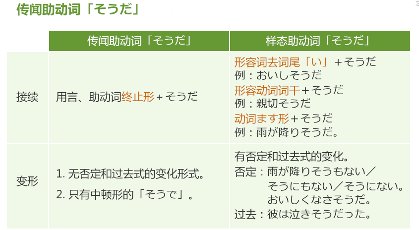

#自谦语和敬语
  * 【注意】謙譲語の使用制限：必须用在与对方有关的自己的动作上
  * 【注意】尊敬语の使用制限：必须用在与自己有关对别人的动作上
  * 【注意】郑重语の使用制限：不是我的动作,郑重地说话来表示对听话人的尊重
  *	【注意】自谦不能和敬语一起使用
  *	【注意】なさる/いらっしゃる/おっしゃる/ござる　接续ます形的时候 去掉る->い
  * 【敬语用法】「お（ご）…になる」尊敬的程度高于「れる」「られる」
      * 【注意1】动词连用形如果是单音节的话不能套用此句型。
      * 【注意2】此句型不搭配意思消极、不好的单词
      * 【注意3】有对应尊敬语的动词不太套用此句型。
  * 【敬语用法】お+动词连用形+です　/　ご+サ变动词词干+です
  * 【敬语注意】复合动词一般是最后的动词用敬语,几个动词时只需要把最后一个动词改成敬语
  * 【敬语注意】主语是 东西、宠物、历史人物、名人 不用敬语
  * 【双重敬语】お見えになる・おいでになる・お越しになる
  * 【郑重语】「ござる」：
    * 【用法1】「でございます」比「です」更恭敬、客气。
    * 【用法2】形容词连用形＋ございます，
      * 词干的最后假名「ア」段 →改为对应的「オ」段假名＋うございます
      * 词干的最后假名「イ」段 →改为ゆ拗音＋うございます
      * 词干的最后假名「ウ」段 →去掉词尾「い」＋うございます
      * 词干的最后假名「オ」段 →去掉词尾「い」＋うございます
    * 【用法3】作为表示存在的「ある」的郑重语
  * 补助动词「いらっしゃる」
    * 【用法1】代替「…ている」，做「…ている」的尊敬语。
    * 【用法2】描述他人的状态以及身份时，「でいらっしゃる」，相当于「です」「である」的尊敬语。

###常用的
  * いらっしゃる →「いる・いく・くる」的尊敬语
    * いらっしゃい（命令型）
    * いらし（用于口语）
  * おいでになる →「いる・いく・くる」的尊敬语，常用于「くる」的尊敬语
  * おる →「いる」的自谦或郑重语
  * お越（こ）しになる → 常用于「いく」「くる」的尊敬语
  * 参（まい）る →「いく」「くる」的自谦或郑重
    * 含有“我”的行为在内的情况下使用，属于郑重语。
  * 伺（うかが）う →「行く・来る・聞く・訪ねる」的自谦语
  * 上（あ）がる →「くる・いく」的自谦语
  * 見える・お見えになる →「くる」的尊敬语（最为正式）
  * おっしゃる →「言う」的尊敬语
  * 申す・申し上げる →「言う」的自谦语
  * 召し上がる・あがる →「食べる・飲む」的尊敬语
  * いただく →「たべる・飲む」的自谦语
  * ご覧になる →「見る」的尊敬语，此处为双重尊敬语
    * ごらん：对下级 、晚辈使用，是带有一种亲切的说话方式。
    * 尊敬语+命令：带有“关爱”和“指令”的语意。 
  * 拝見する →「見る」的自谦语
  * 拝読 →「読む」的自谦语
  * 拝聴 →「聴く」的自谦语
  * 「思う」无尊敬语，常用「思われる」代替表示
  * 存じる →「思う」的自谦语
  * 頂戴する →「もらう」的自谦语
  * 承（うけたまわ）る →「受け取る・聞く」的自谦语
  * お目（め）にかかる →「会う」的自谦语
  * ご存じです →「知っている」的尊敬语
  * 存（ぞん）じる →「知る・思う」的自谦语
  * おめにかける →「見せる」的自谦语
  * 承知する・かしこまる →「分かる・引き受ける」的自谦语
  * する：
    * 【自谦】：いたす
      * お＋動詞「ます」形＋いたす：自谦的表达，表述自己的行为
      * ご＋サ変動詞＋いたす：自谦的表达，表述自己的行为。
    * 【敬语】：なさる

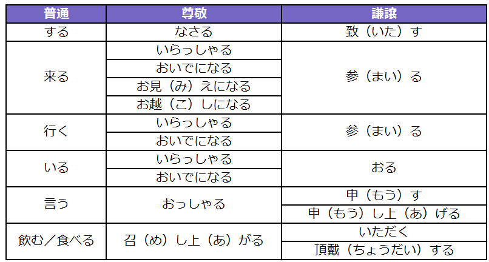
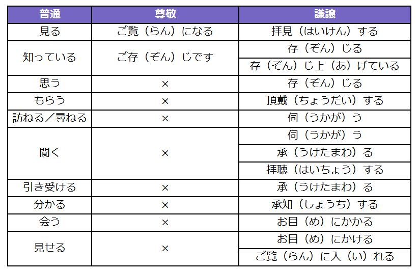
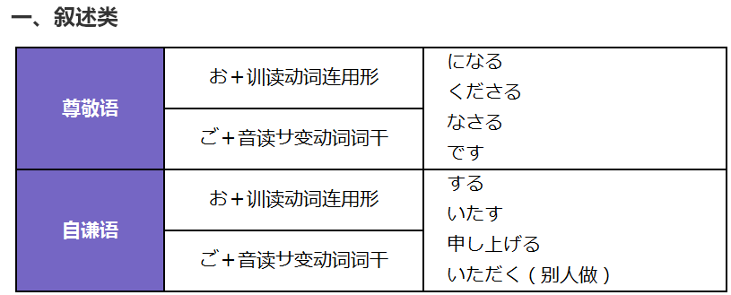
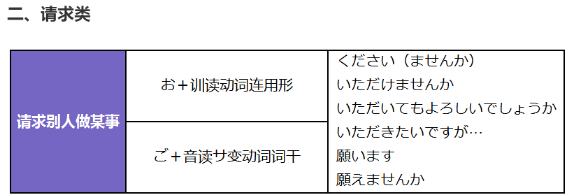

#单词比较
  * 嬉しい和楽しい
    * 喜ぶ：第三人称的时候使用
    * 嬉しい：对事态满足的心情，表示个人的心情
    * 楽しい：对某个事物，一件事情（强调过程）
  * それで/そして/それとも/それから
    * それで：表示主观的原因，“因此…”
    * それとも：表示选择，“或者”
    * それから：表示前后两件事先后发生，“然后…”
    * そして：表示前后两件事先后发生，比「それから」前后连接更紧密，且侧重于后句，“然后…”
    * それに：而且
    * そのかわり：代替前者，作为补偿
    * それでも：尽管那样
    * そこまで：到了这个地步
    * 而且：そして/しかも/そのうえ/また/そのほか/それに
  * 休校/休講/廃校
    * 休講（きゅうこう）：（老师）停讲
    * 休校（きゅうこう）：（学校）停课
    * 廃校（はいこう）：关闭学校
  * 疼痛感相关的词
    * きりきり：身体局部犹如针扎一般的持续地疼痛、绞痛
    * しくしく：轻微地疼痛。
    * ひりひり：皮肤因擦伤或烧伤、晒伤而导致的灼烧的疼痛感
    * ずきずき：能感受到脉搏跳动一般的内部疼痛。一跳一跳地疼
    * ちくちく：确实地针扎、针刺感。
    * がんがん： 犹如脑中敲钟，专门用来描述头痛
  * 弱る/弱まる
    * 弱る：侧重于表示没有活力。
    * 弱まる：侧重于势头的减弱，程度的降低。
  * 恐ろしい/怖い
    * 恐ろしい：侧重客观角度的危险性。可怕的程度更为剧烈，还可以表示一种程度
    * 怖い：侧重主观上的害怕心情。
  * 「ごちそう」vs「もてなす」
    * ごちそう：（对象）に（菜）をごちそうする（一般特指食物的招待）
    * もてなす：（菜）で（某人）をもてなす
  * 冷める/冷ます/冷える
    * 冷める：从很高的温度降为常温
    * 冷ます：他动词
    * 冷える：低于自身的温度
  * かんりょう/しゅうりょう
    * 終了（しゅうりょう）：强调时间活动结束。
    * 完了（かんりょう）：强调做完某事
  * タッチ/かざす
    * かざす：强调从上往下盖住。
    * タッチ：轻轻触碰一下
  * たすける/てつだう
    * 助ける（たすける）：对陷入危机或险境的人助他一臂之力
    * 手伝う（てつだう）：与对方一起、辅助其部分工作使之尽快完成
  * 見える vs 見られる
    * 見える：事物自然映入眼帘，与人的意志无关。
    * 見られる：外部条件决定的一种可能性。
  * 聞こえる vs 聞ける
    * 聞こえる：声音自然传入耳中。
    * 聞ける：外部条件决定的一种可能性。
  * 「悩み」→「苦悩（くのう）」→「苦悶（くもん）」
  * 恐ろしいvs怖い
    * 恐ろしい：侧重事物客观的危险性→恐（おそ）れる
    * 怖い：侧重表达人的主观感受→怖（こわ）がる
  * 可笑（おか）しい/怪（あや）しい
    * おかしい：侧重在不合常规、滑稽可笑。
    * あやしい：侧重在需要注意、保持警惕、不可预测、不可靠
  * 大
    * 多大（ただい）：可用于抽象事物
    * 甚大（じんだい）：多用于不好的事物〔悪いこと〕
    * 莫大（ばくだい）、膨大（ぼうだい）：多用于表示数量上的程度高

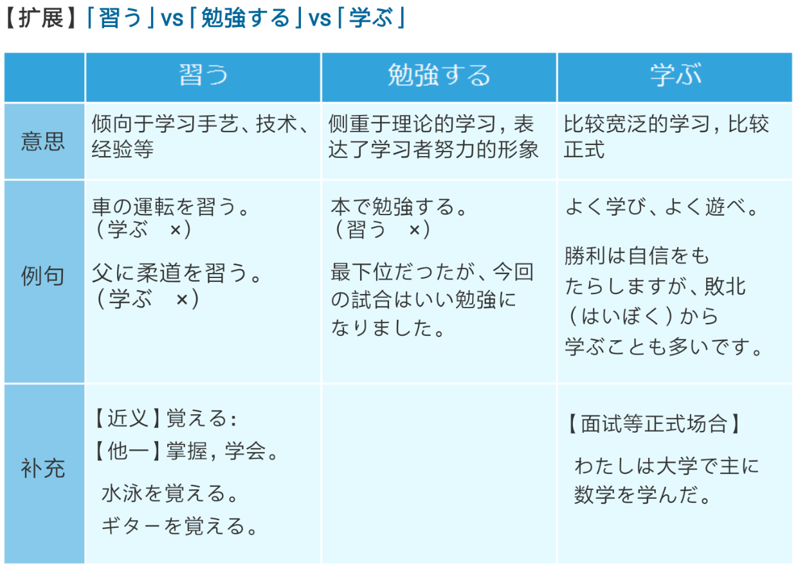

